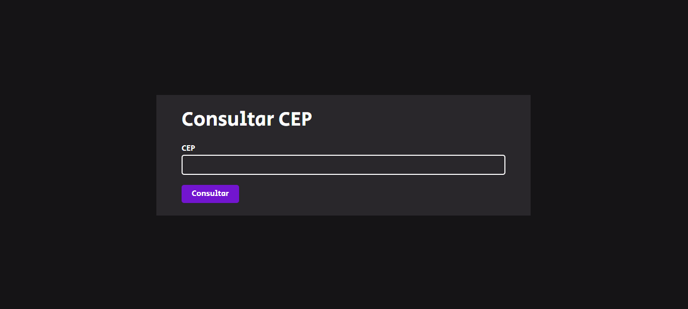
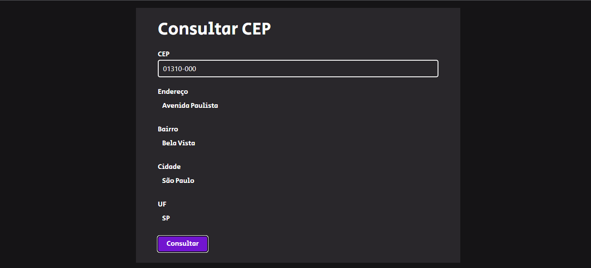

# Consultar CEP

### O projeto consiste em uma simples aplicação para consultar os dados do CEP inserindo utlizando a API dos correios
<br>

 <h1 align="center">
    
    
 </h1>

 ##

 ## Tecnologias utilizadas

 <div style="display: inline_block"><br>
  
  
  
</div>
<br>

##

```bash

#Clone este repositório
$ git clone https://github.com/JoaoPedroVicentin/consultar-CEP.git

##

<p> Feito por João Pedro Vicentin | <a href="https://www.linkedin.com/in/jo%C3%A3o-pedro-vicentin/">Linkedin</a> </p>
